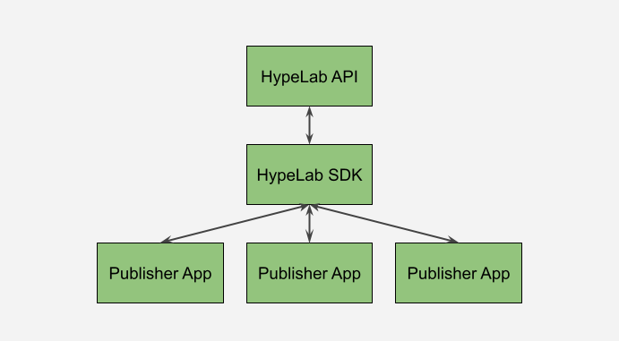

# HypeLab Coding Exercise

## Overview

This is a three-part exercise that will test your abilities across the HypeLab stack. Candidates should expect to spend two to four hours completing the challenge. By the end of this exercise, you should have a basic understanding of how an ads network functions.

Please fork this into a _private_ repo and give read access to your HypeLab engineering contact so that they can review your code. We will use this exercise to assess your (in no particular order):

- _General programming ability_ - Are you able to write code according to specifications? Is your code well-organized and easily digestible?
- _Product sense_ - Are your product design decisions reasonable? Are you able to make good calls between optimizing for speed versus flexibility?
- _Code hygiene_ - Are you writing tests to ensure that your code works as intended?
- _UX design sense_ - Do you have an appreciation for UX and web design concepts? Are you detail-oriented or big-picture?

The instructions may seem vague at first — this was intentional. We're looking for candidates who are resourceful and can think from first principles to design amazing products. Unlike engineers working in large companies, HypeLab's engineers own their products and have the freedom to innovate. In order to complete this challenge, you will have to make some product calls and come up with creative solutions on your own. We'll ask you to explain some of these decisions in any follow-up conversations we might have.

## Architecture

The three components of the challenge are as follows:

- HypeLab API
- HypeLab SDK
- Publisher Application

The HypeLab API is the backbone of our advertising platform. It houses all of our advertisers' campaigns in a database and serves relevant ads through an easy-to-use JSON API.

The HypeLab SDK makes it easy for publishers to interact with our APIs and render ads within their apps. The SDK comes with all of the necessary tools for a publisher to start earning right away.

The Publisher Application is an example of what one of our customers (publisher-side) might look like. Your job is to use the Hypelab SDK that you built in order to add ads monetization.

Each piece is contained in its own folders, and each folder has an easy-to follow `README.md` file that will guide you through the task at hand.

## Troubleshooting

If you run into any errors, please feel free to reach out to ed@hypelab.com!
