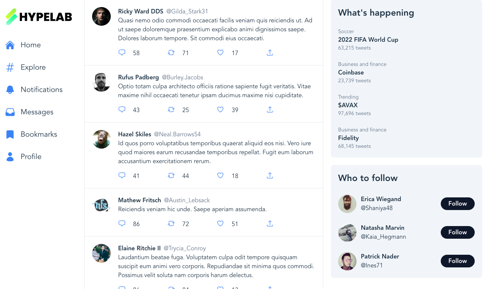

# HypeLab Publisher App

This Vite application contains the skeleton of a publisher web app built in Typescript and React. Publishers are HypeLab customers who want to monetize their web traffic by showing HypeLab ads. Every time a user visits this app, the publisher wants to show an ad to that user somewhere on the page.

Install the `hypelab-light-sdk` that you built and use it to fetch and render ads from the HypeLab API.

## Boot the app

To start the Vite server, install dependencies with `npm install` and then run the app with `npm run dev`.

When you visit http://localhost:5173/, you should see the following:



## Linking the SDK

You can link the packaged version of your SDK by running the command `npm link ../sdk`. This will then allow you to import the HypeLab client via the following line of code:

```
import { HypeLab } from 'hypelab-light-sdk'
```
